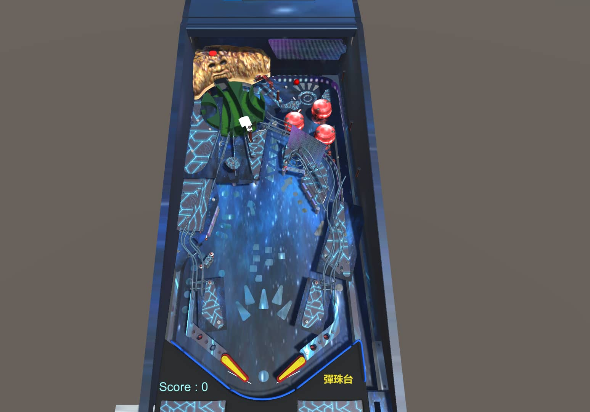

# NSYSU 彈珠檯作業
不多說甚麼，直接上圖。

### 模型貼皮
* 模型來源 :
<a href="" target="_blank" style="font-weight: bold; color: #1CAAD9;">Gilligan's Island Pinball (Bally) 3D</a>
        by <a href="https://sketchfab.com/dark0verseer?utm_medium=embed&utm_campaign=share-popup&utm_content=0a45f0192ed14fb682f322e5d52bd9f7" target="_blank" style="font-weight: bold; color: #1CAAD9;">dark0verseer</a>
        on <a href="https://sketchfab.com?utm_medium=embed&utm_campaign=share-popup&utm_content=0a45f0192ed14fb682f322e5d52bd9f7" target="_blank" style="font-weight: bold; color: #1CAAD9;">Sketchfab</a>
    

* 音效: 統神端火鍋(如有侵權請[聯絡我](mailto:kidneyweakx@gmail.com))

### Bugs & TODO
1. 碰到上方空氣牆會直接重新遊戲(斜15度的關係，無法固定X軸)
2. 滾落速度很慢，可能模型太大了，我連光滑度都設很低了
